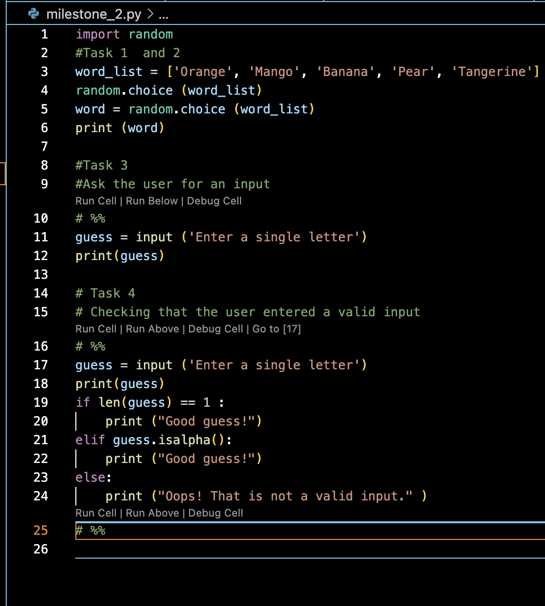
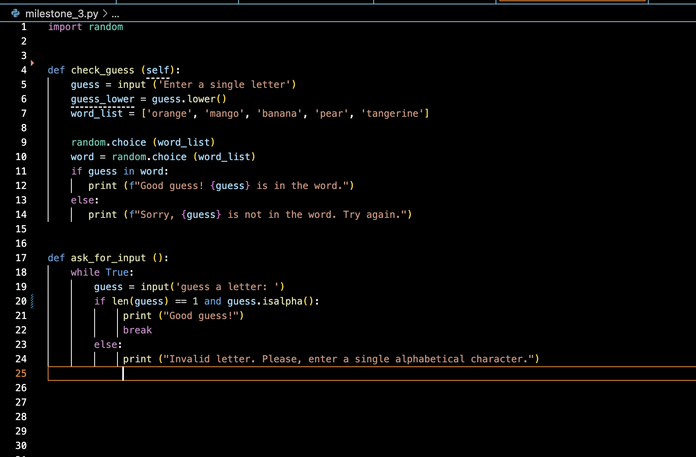

# Hangman
Hangman is a classic game in which a player thinks of a word and the other player tries to guess that word within a certain amount of attempts.

This is an implementation of the Hangman game, where the computer thinks of a word and the user tries to guess it. 

Milestone 1 
Setting up the environment
---
Milestone 2
The preliminary game logic for the overall project was established here. The main objective was to introduce control flows such as if else to help check user's input. The file milestone_2.py was created which contained the code for this milestone and  it contained random list called word_list wherein random choice of words can be selected at intervals. 

> Snapshot of Milestone 2

Milestone 3
This section uses iterations with the While loop to check accurately if the input the user sends is a valid input. Also, If statements are used to contruct the flow in such a way to check if the letter guessed is in the word. These two important aspects of the code are captured in two functions namely: ask_for_input and check_guess respectively

> Snapshot of Milestone 3

Milestone 4
Utilising object oriented programming, a class HangMan was created.
The word_list depicts the entire words that can be guessed whilst the num_lives represents the number of times the player can repeat the game before reaching the end of the game. 
Two methods 'check_guess' and 'ask_for_input' will allow the player confirm their guesses and validate that the letter guessed are in the secret 'word'.

Milestone 5

This encompasses the logic for the Hangman game. A new funtion
play_game was defined to set the prerequisite of how the player would play the game and throw in their guesses.

Conclusions
This project has in piece meals shown me how to group and build logic on the Hangman game. With each milestone, I have used relevant Python syntax and functions which has allowed me practice my learings. The object oriented programming as shown in MIlestone 4, depicts the true importance of creating a class and utilsing it within Python.

